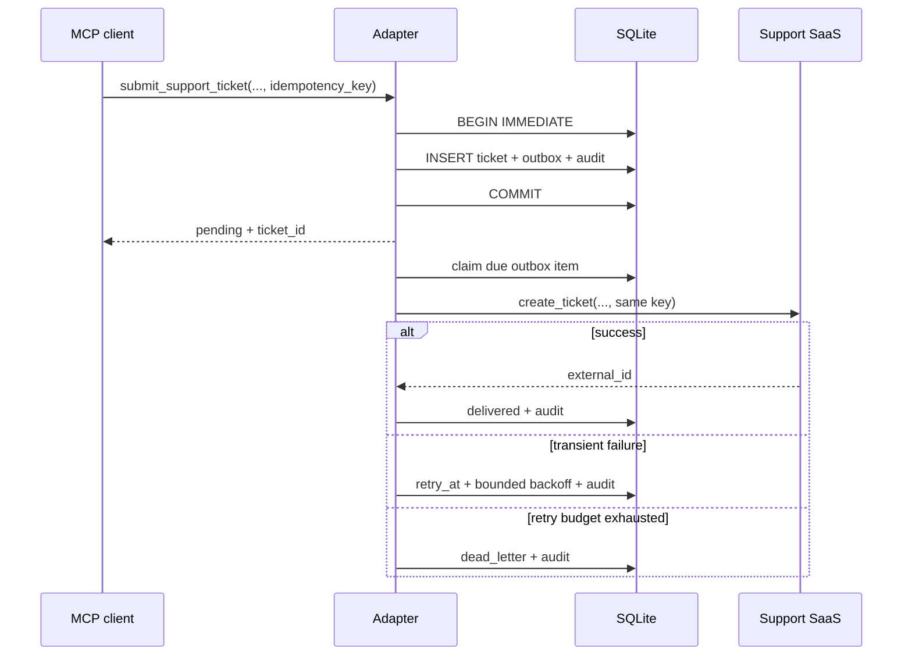

# MCP Reliable Adapter

A small, clean-room reference implementation of an MCP server that accepts support tickets even
when a downstream SaaS is temporarily unavailable. It demonstrates a transactional outbox,
semantic idempotency, bounded exponential retries, dead-letter handling, recovery after restart,
and an inspectable audit trail—with only SQLite as infrastructure.

> **Portfolio scope:** this is deliberately compact and uses a fictional SaaS. It illustrates the
> delivery boundary and its failure modes; it is not presented as a production-ready help desk.

## Why this exists

An MCP tool call and a third-party API call cannot share a transaction. If the process stops at the
wrong instant, a naive adapter can lose the request or create the same ticket twice. This project
first commits the request and an outbox item atomically, then performs the external side effect.
Every retry carries the original idempotency key.



## Quickstart

Requires Python 3.12+.

```bash
python3.12 -m venv .venv
source .venv/bin/activate
python -m pip install -e '.[dev]'
pytest
python -m build
mcp-reliable-adapter
```

The final command starts the official MCP Python SDK's `stdio` transport. A client can configure
the command directly; set `ADAPTER_DB_PATH` when the database should live elsewhere:

```json
{
  "mcpServers": {
    "reliable-support": {
      "command": "/absolute/path/.venv/bin/mcp-reliable-adapter",
      "env": {"ADAPTER_DB_PATH": "/absolute/path/adapter.db"}
    }
  }
}
```

## Tools

### `submit_support_ticket`

Inputs: `subject`, `description`, and a caller-generated `idempotency_key`. It commits a ticket,
outbox item, and audit event in one local transaction and returns a stable `ticket_id`. Repeating
the same payload and key returns the original ticket. Reusing the key for a different payload
returns a conflict instead of silently conflating two requests.

### `get_delivery_status`

Input: `ticket_id`. It advances due demo deliveries, then returns `pending`, `delivered`,
`dead_letter`, or `not_found`, plus delivery metadata when available.

## Local demo without an MCP client

```bash
python - <<'PY'
from pathlib import Path
from tempfile import TemporaryDirectory
from mcp_reliable_adapter import FakeSupportSaaS, ReliableAdapter

with TemporaryDirectory() as directory:
    adapter = ReliableAdapter(Path(directory) / "demo.db", FakeSupportSaaS(failures_before_success=1))
    ticket = adapter.submit_support_ticket(
        subject="Synthetic demo",
        description="No real customer data.",
        idempotency_key="demo-001",
    )
    adapter.process_due()                 # simulated outage; retry scheduled
    print(adapter.get_delivery_status(ticket["ticket_id"]))
    print(adapter.get_audit_trail(ticket["ticket_id"]))
PY
```

## Guarantees and failure semantics

- **Durable acceptance:** the tool returns only after the ticket, outbox item, and first audit
  record commit together.
- **Same-key consistency:** a key identifies one canonical request body; conflicting reuse fails.
- **At-least-once delivery attempts:** claimed work is requeued on startup, so a crash does not
  strand it permanently.
- **Effectively-once downstream creation—conditional:** duplicate network attempts produce one
  logical ticket only if the downstream system honors the forwarded idempotency key.
- **Bounded retrying:** exponential delay is capped, the attempt budget is finite, and exhausted
  work is visible as `dead_letter` rather than looping forever.
- **Auditability:** acceptance, duplicate submissions, retry decisions, successful delivery, and
  dead-letter transitions are written as insert-only events by the application. SQLite does not
  make the table tamper-evident; a process with direct database access can still alter it.

## Limitations and production path

- The bundled SaaS is an in-memory fake; replace it with an authenticated HTTP adapter, explicit
  timeouts, response classification, and safe credential injection.
- The demo processes due work during a status call. A real deployment should run a supervised
  worker independently of MCP request traffic.
- SQLite is appropriate for a single-host example. Multiple workers need stronger claiming/lease
  semantics; a production service would commonly use PostgreSQL `FOR UPDATE SKIP LOCKED`.
- There is a small crash window after the SaaS accepts a request but before local success commits.
  The downstream idempotency contract is therefore essential.
- Restart recovery immediately requeues every `processing` item. A multi-process deployment needs
  expiring leases so one live worker's claim is not stolen.
- The audit trail has no retention policy, tamper-evident signatures, or PII redaction layer.
- Authentication, authorization, rate limiting, observability export, schema migrations, and
  operator-driven dead-letter replay are intentionally outside this compact example.
- Tool inputs are intentionally small demo strings but are not size-limited. Do not expose this
  server to untrusted clients without authentication, authorization, input limits, and resource
  quotas.

## Tests

The ten focused test scenarios cover:

1. identical idempotent submissions;
2. conflicting key reuse;
3. successful delivery and audit state;
4. scheduled exponential backoff;
5. retry exhaustion and dead-letter state;
6. persistence and recovery after process restart;
7. stale concurrent claims respecting attempt counts and retry deadlines;
8. invalid retry configuration;
9. rejection of SQLite's connection-local `:memory:` mode;
10. generated MCP input/output schema compatibility.

## Español (resumen)

Este proyecto muestra cómo aceptar una solicitud MCP de forma durable antes de llamar a un SaaS
inestable. La solicitud y el mensaje de salida se guardan juntos en SQLite; luego un worker intenta
la entrega con la misma clave de idempotencia. Los fallos temporales generan reintentos con espera
exponencial y límite, y los fallos agotados quedan visibles en una cola muerta. El historial registra
cada transición. El alcance es educativo: para producción faltan autenticación, un worker separado,
leases multiworker, observabilidad y políticas de datos.

See [PROVENANCE.md](PROVENANCE.md) for the clean-room statement and [SECURITY.md](SECURITY.md) for
the demo's trust boundary. Licensed under MIT.
